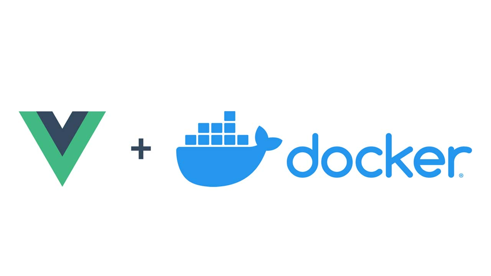

Docker is a great technology to handle all dependencies quickly
and make sure that all developers have the same environment. That's
why here we are going to learn how to dockerize an app, what type of
app, well, a Vuejs app. Vuejs is a technology which is having a huge
fan base, so for all people who like Vuejs, here you will know how
to dockerize a Vuejs app.

We are going to use yarn in the dockerfile and .dockerignore, if you
want to use npm, just change the commands or the files to the npm
equivalent, and it has to work properly.


First, we're going to do, is to specify the base image that the
container is going to inherit from, the image is going to be the
latest version of node, as you can see:

```dockerfile
FROM node:latest
```

Then, we need to set the working directory. The working directory is
where our app will be, so this is the next line of code:

```dockerfile
WORKDIR /app
```

Also, we have to add `node_modules/.bin` to the PATH, with this we
ensures that the executables created during `yarn serve` (or `npm run
dev`) process can be found. And we do it like this:

```dockerfile
ENV PATH /app/node_modules/.bin:$PATH
```

Now it's the time to copy the package.json and yarn.lock (package-lock.json
if you're using npm) and install the dependencies in our container:

```dockerfile
COPY package.json /app/package.json
COPY yarn.lock /app/yarn.lock
RUN yarn install
```

Because we're using Vue, and it has its own cli, we have to install it too:

```dockerfile
RUN yarn global add @vue/cli
```

And finally we start to run the serve:

```dockerfile
CMD ["yarn", "serve"]
```

Now the dockerfile is well done, the next it's to specify which files
and folders we want to ignore. This is easy, the first is the
`node_modules` and the `.git` and `.gitignore`, maybe you wondering
why the `node_modules`, the answer is easy, we already created the
node_modules in the containter in the Dockerfile, so we don't want to
override the container's node_modules with the host's node_modules. And
.git and .gitignore we're going to ignore because we don't need them
in the container. Then, the others files that we're going to ignore is
the logs, and it's also because we don't need them in the container. And
the dockerignore will be like this:

```dockerignore
node_modules
.git
.gitignore

# Log files
npm-debug.log*
yarn-debug.log*
yarn-error.log*
```

Ok, now we have everything done to create our image, container and
start to code like a pro 😎. The docker command to create the
image with a name and a tag is:

```bash
docker build -t my-app:dev .
```

This command create a container with the name **my-app** and the tag
**dev**. And to run the container is with the `docker run` command like
you will see:

```bash
docker run -v ${PWD}:/app -v /app/node_modules -p 8080:8080 --rm my-app:dev
```

#### What is going on here?

Well, let me explain:

1. `-v ${PWD}:/app` creates a volume with the path of the project
with the path of the project in the container, this allow to see
all changes done in the host also in the container.

2. `-v /app/node_modules` creates a [anonymous](https://medium.com/faun/what-are-anonymous-and-named-volumes-6cd787822a7d)
volume. This allow that the host's node_modules is use instead of
the host's node_modules.

3. `-p 8080:8080` exposes the port of the container with the port of
the host. By the way, you can change the port of the host (e.g.
8081), the left is the port of the host, and the right the port of
the container.

4. `--rm` removes the container and the volumes when the container
execution ends.

Now you can go to **localhost:8080** and see the app. This is great, but
you have to run the above docker run command every time you want to
run the app, and this could be painful if you add more settings, so
this is why I always use docker compose, because it lets me to set all
the configuration, and then the command to execute the container is
always the same.

To use docker compose, first we have to create a `docker-compose.yml`
file. And add the following lines:

```yml
version: '3.7'

services:
  my-app:
    container_name: my-app
    build:
      context: .
      dockerfile: Dockerfile
    volumes:
      - '.:/app'
      - '/app/node_modules'
    ports:
      - '8080:8080'
```

Well, here there are a lot of things to explain, but some of them
are self-explanatory. First, we set the version of the docker compose,
then we list all services we want to create (each service is a
container), in this example we just have one container, so the name of
the service is *my-app*. Now we specify the name of the container,
later we build our container, we specify the context and the Dockerfile
to use. The container is pretty straightforward to analyze and finaly
we expose the ports.

So then the command to create the image is:

```bash
docker-compose build
```

And the command to create the container is:

```bash
docker-compose up -d
```

And the commands to start and stop the container are:

```bash
docker-compose start
docker-compose stop
```

And that's it, with **docker compose** is pretty easy to create and
run containers.

### All files finally

Dockerfile:

```dockerfile
# Setting the base image
FROM node:lts-alpine

# Set working directory
WORKDIR /app

# Add `/app/node_modules/.bin` to $PATH
ENV PATH /app/node_modules/.bin:$PATH

# Install and cache app dependencies
COPY package.json /app/package.json
COPY yarn.lock /app/yarn.lock
RUN yarn install

# Installing the vue cli
RUN yarn global add @vue/cli

# Start app
CMD ["yarn", "serve"]
```

.dockerignore:

```dockerignore
node_modules
.git
.gitignore

# Log files
npm-debug.log*
yarn-debug.log*
yarn-error.log*
```

docker-compose.yml:

```yml
version: '3.7'

services:
  web:
    container_name: prueba
    build:
      context: .
      dockerfile: Dockerfile
    volumes:
      - '.:/app'
      - '/app/node_modules'
    ports:
      - '8080:8080'
```
